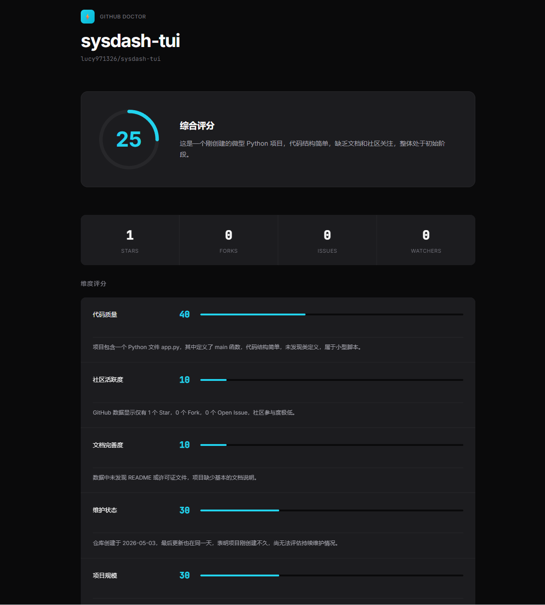
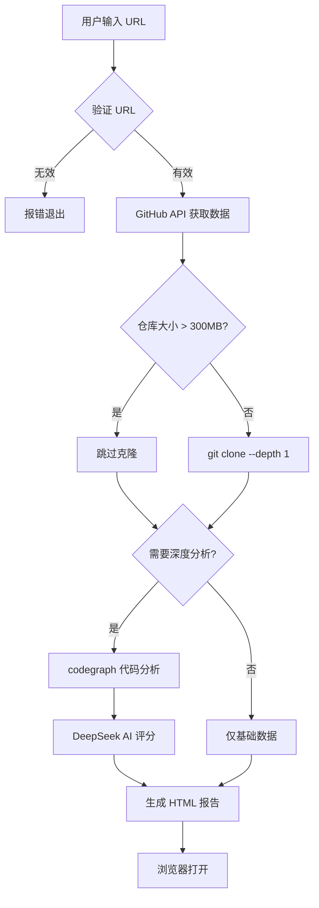

# 🏥 GitHub Doctor

GitHub 仓库体检工具 — 输入 URL，自动生成可视化分析报告。
注: 仅支持windows系统


## 核心亮点

| 特性 | 说明 |
|------|------|
| **codegraph 深度分析** | 集成 codegraph 解析代码结构、函数/类数量、调用关系，而非仅读取表面指标 |
| **智能仓库判断** | 自动检测仓库大小，>300MB 跳过克隆和代码分析，避免超时 |
| **浅克隆优化** | 使用 `--depth 1` 只拉最新代码，大幅减少克隆时间和磁盘占用 |
| **GitHub Token** | 支持 Token 认证，API 限额从 60 次/小时提升至 5000 次/小时 |
| **代理加速** | 支持配置代理端口，解决国内访问 GitHub 慢的问题 |
| **AI 智能评分** | DeepSeek 结构化输出，多维度评价 + 专业评语 |
| **零依赖部署** | 单个 exe 文件，自动下载 codegraph，用户无需安装任何环境 |

## 设计思想

**为什么用 codegraph？**

传统方案只读取 GitHub API 的表面数据（Star、Fork 等），无法了解代码真实质量。集成 codegraph 后，可以解析 AST 提取函数、类、调用关系，让 AI 基于代码结构给出专业评价。

**为什么做仓库大小判断？**

大仓库（如 Linux 内核）克隆耗时巨大，且 codegraph 分析也会很慢。自动检测并跳过，用户体验更好。

**为什么支持代理？**

国内访问 GitHub 经常超时，配置代理后 codegraph 下载和 API 调用都能正常使用。

## 功能

- GitHub API 基础指标（Star / Fork / Issues / 语言分布）
- codegraph 代码结构分析
- DeepSeek AI 智能评分
- 深色主题可视化报告

## 快速开始

```bash
# 编译
go build -o github-doctor.exe .

# 运行
.\github-doctor.exe
```

按提示输入：
1. GitHub 仓库 URL
2. GitHub Token（可选，提升 API 限额）
3. 代理端口（可选，加速下载）
4. 是否深度分析（y/n）
5. DeepSeek API Key（仅深度分析需要）

**codegraph 说明：** 首次深度分析时会自动下载 codegraph。如自动下载失败，可手动安装：

```bash
# npm 安装
npm i -g @colbymchenry/codegraph

# 或使用官方安装脚本
curl -fsSL https://raw.githubusercontent.com/colbymchenry/codegraph/main/install.sh | sh
```

## 架构



## 技术栈

- Go 1.25
- GitHub REST API
- codegraph（代码分析）
- DeepSeek API（AI 评分）

## License

MIT
